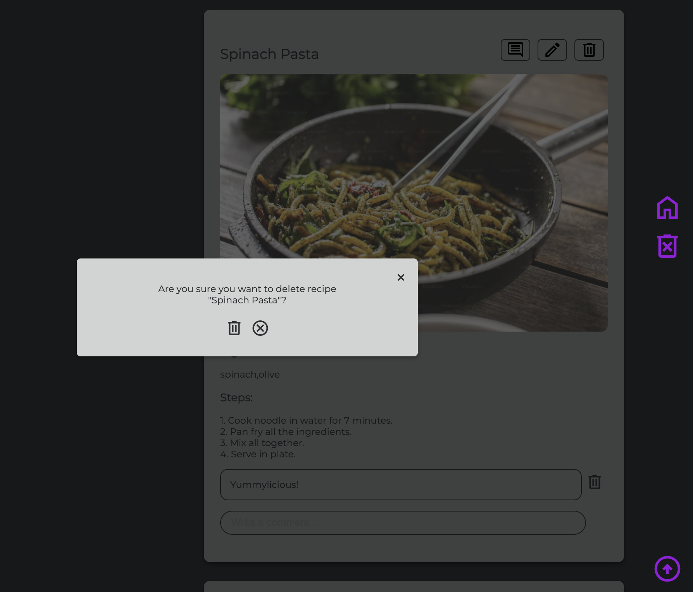
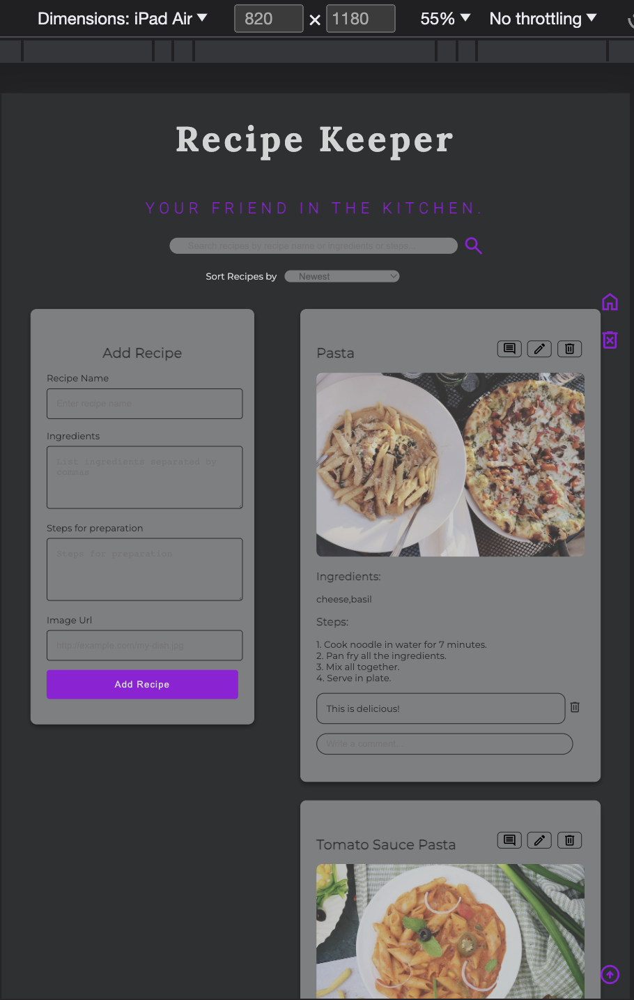
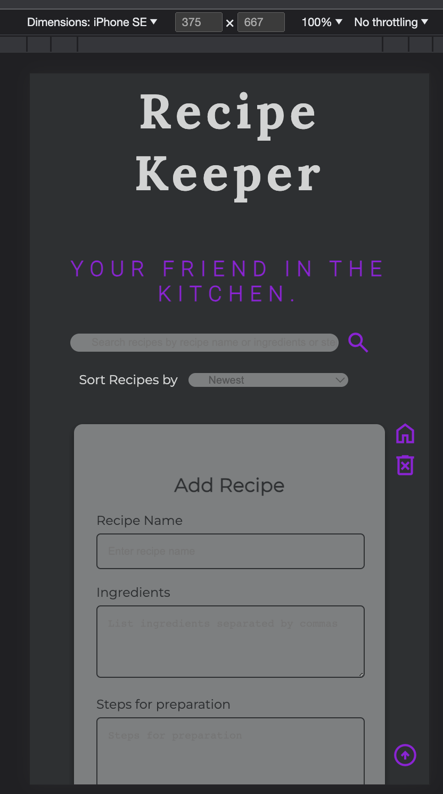
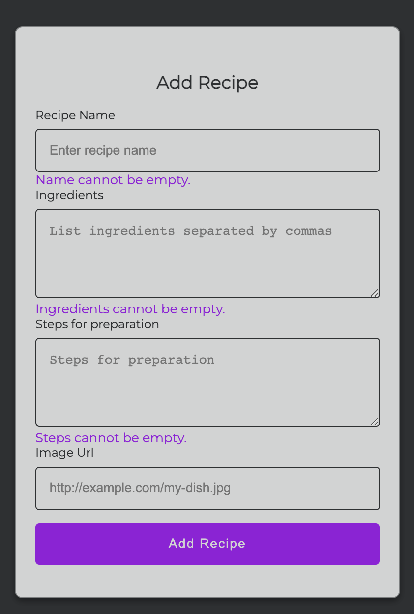

# recipeKeeper

A Full Stack Web Application managing recipes (Add, Edit, Delete, Search and Sort) using full stack technologies:

-   Front-end: HTML, JavaScript, and CSS
-   Back-end APIs: Python FastAPI.

# 

# 

# 

# 

# 

# 

# 
